# 🚀 DevBoard Pro – Smart Project & Task Management System

A modern full-stack **Project & Task Management** web application built using **Python, Flask, SQLAlchemy, SQLite, Bootstrap 5, and Chart.js**.

DevBoard Pro allows users to securely manage projects and tasks, visualize progress with interactive dashboards, monitor deadlines, export data, and manage their profile through a clean, responsive interface.

---

# ✨ Features

## 🔐 Authentication
- User Registration
- Secure Login & Logout
- Password Hashing (Werkzeug)
- Session Management (Flask-Login)
- CSRF Protection (Flask-WTF)
- Profile Update
- Change Password

---

## 📁 Project Management
- Create Project
- Edit Project
- Delete Project
- Search Projects

---

## ✅ Task Management
- Create Task
- Edit Task
- Delete Task
- Search Tasks
- Due Date Tracking
- High / Medium / Low Priority
- To Do / In Progress / Completed Status
- Overdue Task Detection

---

## 📊 Dashboard
- Total Projects
- Total Tasks
- Completed Tasks
- Overdue Tasks
- Task Status Chart
- Priority Distribution Chart
- Completion Percentage

---

## 🌙 Additional Features
- Dark Mode
- CSV Export
- Responsive Design
- Mobile Friendly UI

---

# 🛠 Tech Stack

## Backend
- Python
- Flask
- SQLAlchemy
- Flask-Login
- Flask-WTF
- Werkzeug

## Frontend
- HTML5
- CSS3
- Bootstrap 5
- JavaScript
- Bootstrap Icons
- Chart.js

## Database
- SQLite

---

# 🏛 System Architecture

```text
                     User
                       │
                       ▼
            ┌────────────────────┐
            │     Web Browser    │
            │ HTML • CSS • JS    │
            │ Bootstrap 5        │
            └─────────┬──────────┘
                      │
                 HTTP Requests
                      │
                      ▼
          ┌────────────────────────┐
          │      Flask Server      │
          │    Python Backend      │
          └──────────┬─────────────┘
                     │
     ┌───────────────┼────────────────┐
     │               │                │
     ▼               ▼                ▼
 Authentication   Project CRUD     Task CRUD
 Flask-Login
 Flask-WTF
                     │
                     ▼
              SQLAlchemy ORM
                     │
                     ▼
               SQLite Database
```

---

# 🗄 Database Schema

```text
+----------------------+
|        User          |
+----------------------+
| id (PK)              |
| username             |
| email                |
| password_hash        |
+----------------------+
          │
          │ One-to-Many
          ▼
+----------------------+
|      Project         |
+----------------------+
| id (PK)              |
| title                |
| description          |
| created_at           |
| owner_id (FK)        |
+----------------------+
          │
          │ One-to-Many
          ▼
+----------------------+
|        Task          |
+----------------------+
| id (PK)              |
| title                |
| description          |
| due_date             |
| priority             |
| status               |
| project_id (FK)      |
+----------------------+
```

---

# 📂 Project Structure

```text
devboard-pro/
│
├── app/
│   ├── forms/
│   ├── models/
│   ├── routes/
│   ├── static/
│   │   ├── css/
│   │   └── js/
│   ├── templates/
│   └── extensions.py
│
├── instance/
├── screenshots/
├── requirements.txt
├── run.py
└── README.md
```

---

# 📸 Application Screenshots

## 🏠 Landing Page

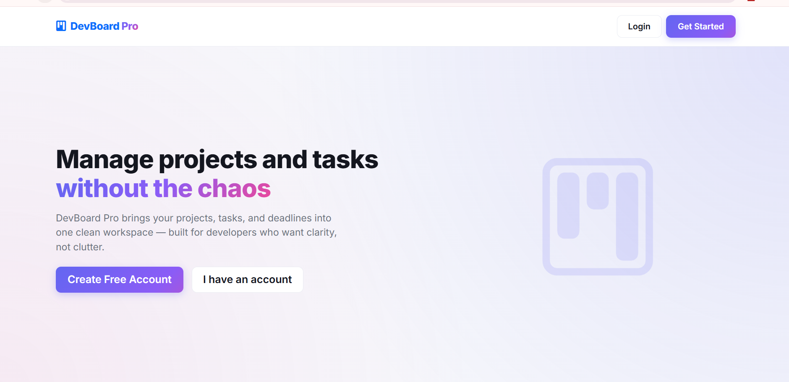

---

## 🔐 Login

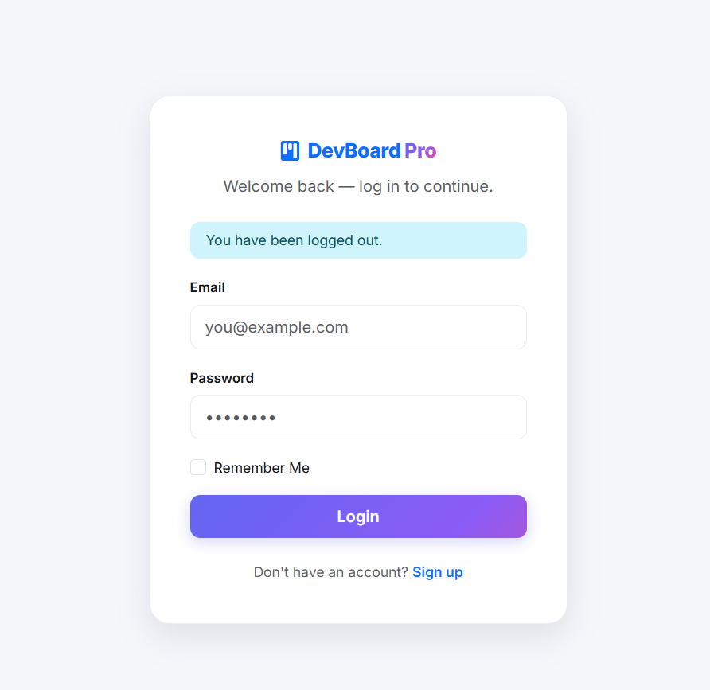

---

## 📝 Register

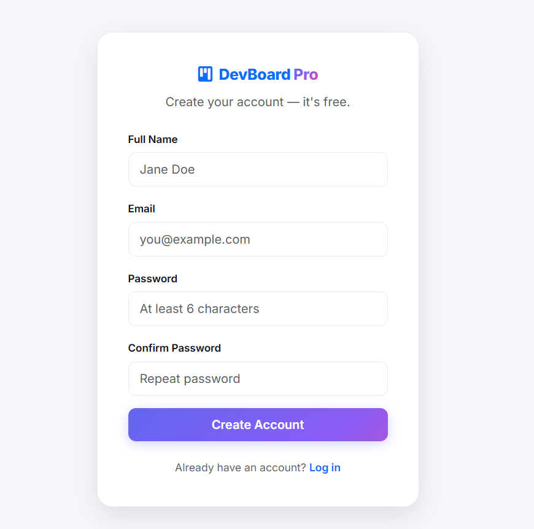

---

## 📊 Dashboard

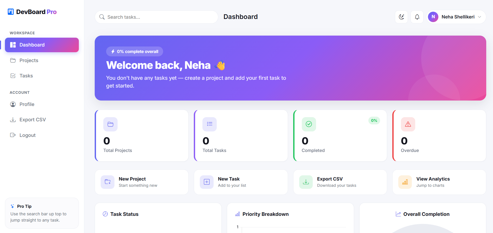

---

## 📈 Dashboard Analytics

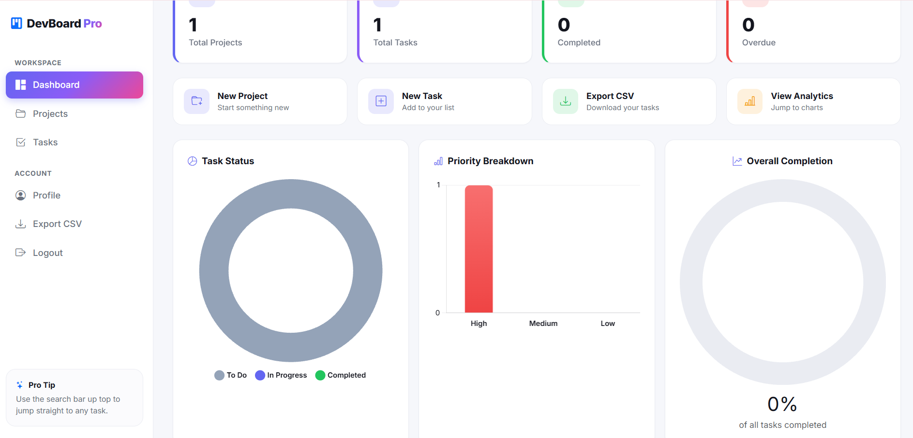

---

## 📋 Dashboard Overview

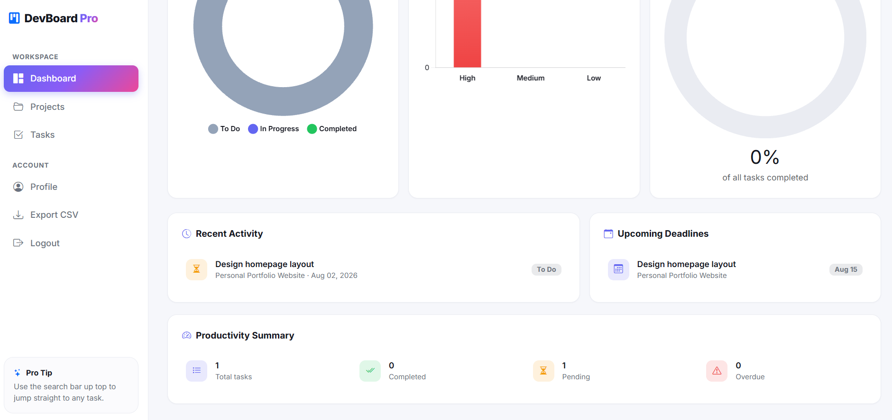

---

## 📁 Projects

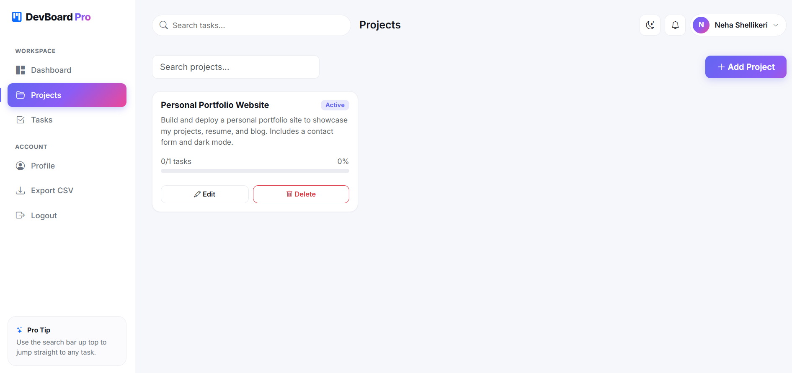

---

## ✅ Tasks

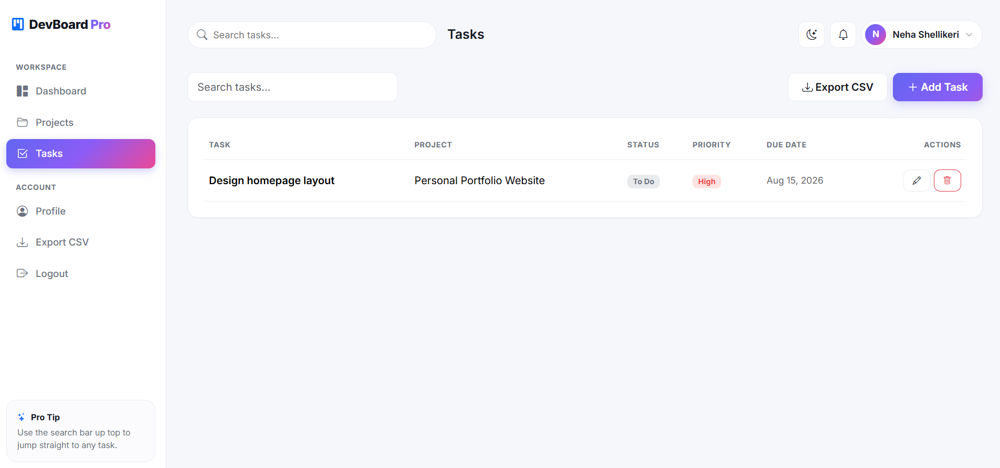

---

## ➕ Create Task

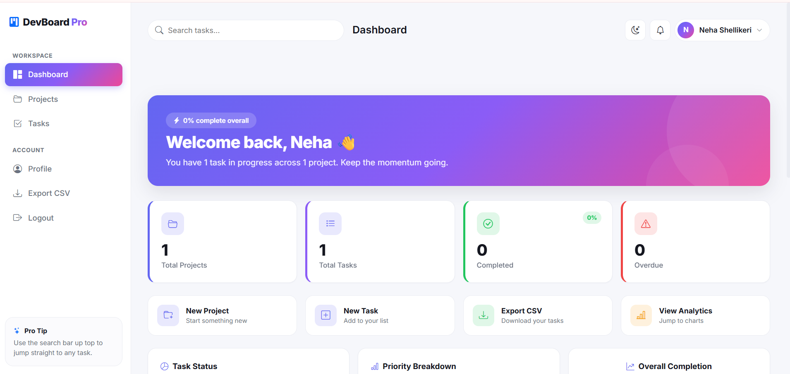

---

## 👤 User Profile

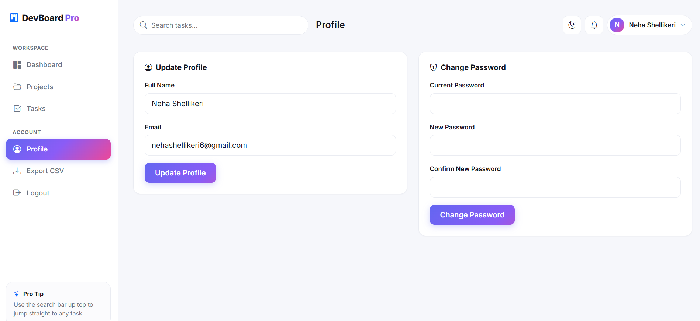

---

## 🌙 Dark Mode

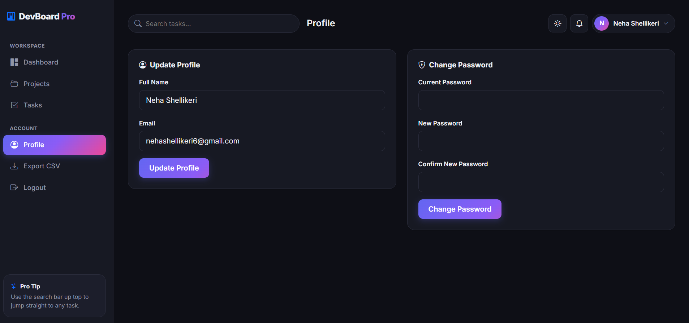

---

## 📤 CSV Export

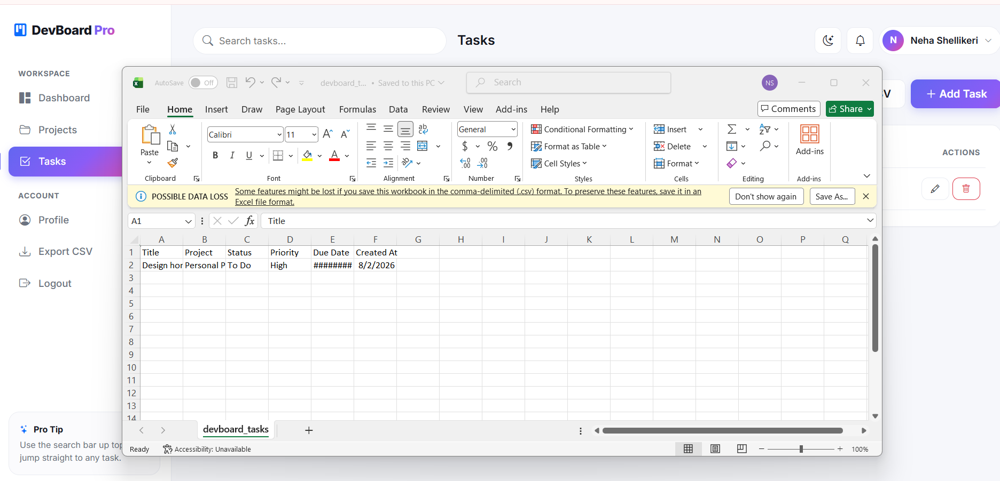

---

# 🔄 Application Workflow

```text
Register/Login
      │
      ▼
Authentication
      │
      ▼
Dashboard
      │
      ├───────────────┐
      │               │
      ▼               ▼
Projects         User Profile
      │
      ▼
Tasks
      │
      ▼
Dashboard Analytics
      │
      ▼
CSV Export
```

---

# 📚 Software Engineering Concepts

- Object-Oriented Programming (OOP)
- MVC Architecture
- Authentication & Authorization
- Session Management
- CRUD Operations
- SQLAlchemy ORM
- Database Relationships
- Form Validation
- Password Hashing
- Data Visualization
- Responsive Web Design

---

# ⚙ Installation

Clone the repository

```bash
git clone https://github.com/Nehashellikeri/DevBoard-Pro.git
```

Move into the project folder

```bash
cd DevBoard-Pro
```

Create a virtual environment

```bash
python -m venv venv
```

Activate it

### Windows

```bash
venv\Scripts\activate
```

### Linux/macOS

```bash
source venv/bin/activate
```

Install dependencies

```bash
pip install -r requirements.txt
```

Run the application

```bash
python run.py
```

Open

```
http://127.0.0.1:5000
```

---

# 📈 Future Enhancements

- Google OAuth Login
- REST API
- Docker Deployment
- PostgreSQL Database
- Team Collaboration
- File Attachments
- Calendar Integration
- Kanban Board
- Email Notifications
- Cloud Deployment

---

# 📊 Project Metrics

| Category | Technology |
|-----------|------------|
| Language | Python |
| Framework | Flask |
| ORM | SQLAlchemy |
| Database | SQLite |
| Authentication | Flask-Login |
| Forms | Flask-WTF |
| Frontend | HTML5, CSS3, Bootstrap 5 |
| Charts | Chart.js |
| Responsive | ✅ |
| Dark Mode | ✅ |
| CSV Export | ✅ |

---

# 💡 Why I Built This

DevBoard Pro was developed to strengthen my understanding of full-stack web development using Python and Flask. The project demonstrates secure authentication, relational database design, modular backend architecture, responsive frontend development, and interactive dashboards. It follows software engineering best practices such as MVC architecture, reusable components, ORM-based database interactions, and clean project organization.

---

# 👩‍💻 Developer

**Neha Shellikeri**

M.Tech (Computer Science & Engineering)

Interested in Software Development, Artificial Intelligence, Cloud Computing, and Full-Stack Development.

---

## ⭐ If you found this project useful, consider giving it a star on GitHub!